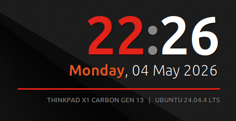

# my-conky-config

[](images/image.png)

A minimal [Conky](https://github.com/brndnmtthws/conky) setup inspired by the ThinkPad look-and-feel, displaying a large clock, date, machine model, and OS name in the top-right corner of the desktop.

## Preview

The overlay shows:
- Large bold clock (HH:MM) in ThinkPad red
- Day of week and full date in Ubuntu orange / white
- Machine model and OS name in dimmed grey

## Files

| File | Description |
|------|-------------|
| `thinkpad.conf` | Conky configuration (appearance, layout, variables) |
| `conky.service` | systemd user service unit |
| `install.py` | Install / uninstall script |

## Requirements

- Ubuntu (uses `apt`)
- A running graphical session (X11 or XWayland)
- Python 3.9+

## Usage

### Install

```bash
python3 install.py install
```

This will:
1. Install `conky-all` via `apt`
2. Copy `thinkpad.conf` to `~/.config/conky/thinkpad.conf`
3. Copy `conky.service` to `~/.config/systemd/user/conky.service`
4. Enable and start the service so Conky launches automatically with your graphical session

### Uninstall

```bash
python3 install.py uninstall
```

This will stop and disable the service, remove the installed files, and uninstall `conky-all`.

### Dry run

Pass `--dry-run` to preview all actions without making any changes:

```bash
python3 install.py install --dry-run
python3 install.py uninstall --dry-run
```

## Manual service management

```bash
# Check status
systemctl --user status conky.service

# Restart after editing thinkpad.conf
systemctl --user restart conky.service

# Stop temporarily
systemctl --user stop conky.service
```
